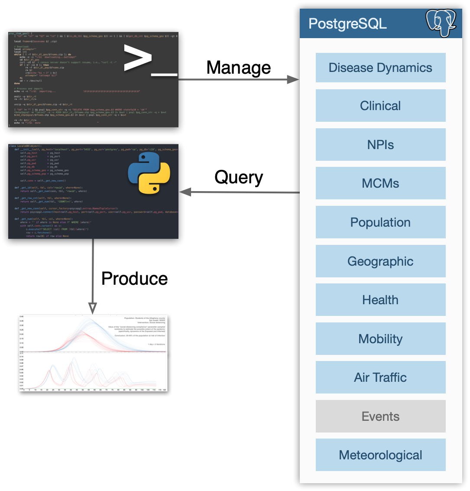

# LocaleDB

A database of global locales to support modeling and simulation in epidemiology with the current focus on the COVID 19 pandemic.


## Design

As shown on the figure below, LocaleDB stores several types of data (gray boxes indicate planned future extentions).  That data is stored in a PostgreSQL database which is managed by a command line tool ([`localedb`](localedb)) and a Python script ([`localedb_man.py`](localedb_man.py)).  The content of the database is accessed via a Python package which provides a high level API to, for example, suggest U.S. counties similar to the county specified.

<center></center>

This design that separates data management and data consumption reflects the anticipated production use case.  Namely, the database will be deployed and set up once and will then require little to no manual management (periodic updates will be autonomous).  It will then be used for producing data that will drive modeling and simulation efforts.


## Data Types

As depicted on the figure above, the current projection is for LocaleDB to contain the following data types:

- **Disease dynamics** (e.g., number of confirmed cases)
- **Clinical** (e.g., R0, incubation period, proportion of asymptomatic cases, etc.)
- **Non-pharmaceutical interventions** (**NPIs**; e.g., dates of stay-at-home order)
- **Medical countermeasures** (**MCMs**; e.g., vaccine availability, efficacy, and allocation strategies)
- **Population** (e.g., households, their incomes, age of people, etc.)
- **Geographic and cartographic** (e.g., area of land, population density)
-​**Mobility** (mobile-phone based)
- **Health factors and outcomes** (e.g., diet, exercise, access to care, etc.)
- **Local events** (e.g., dates and sizes of mass protests)
- **Meteorological**

All that data will be stratified by locale at all available levels of spatial aggregation (e.g., country, state, county, tract, block group, block).  In terms of temporal resolution, the highest frequency with which processes are sampled/measured will be the goal.  For example, disease dynamics will be represented as a time series of daily numbers of confirmed cases and deaths, while health factors and outcomes will be encoded with far fewer time steps (probably months).


## Dependencies: Database Server

LocaleDB can be deployed to a development and production environments.  It is recommended to familiarize yourself with the software using the development environment first.

### Development Environment

- curl or wget
- [Docker](https://www.docker.com)

### Production Environment

- curl or wget
- PostgreSQL client
- PostgreSQL server (with [PostGIS](https://github.com/postgis/postgis) and [TimescaleDB](https://github.com/timescale/timescaledb) extensions)
- [Python 3](https://www.python.org)

**Note**: LocaleDB should not be deployed to a production environment yet.  This note will be removed when that deployment mode has been fully implemented and fully tested.


## Dependencies: Python Package

- [Python 3](https://www.python.org)
- [psycopg2](https://pypi.org/project/psycopg2)


## Setup

### Command Line Management Tool

On MacOS run:

```
sh -c "$(curl -fsSL https://raw.githubusercontent.com/momacs/localedb/master/setup.sh -O -)"
```

On Linux run:
```
sh -c "$(wget -q https://raw.githubusercontent.com/momacs/localedb/master/setup.sh -O -)"
```

Alternatively, you can run the commands from the [`setup.sh`](setup.sh) script manually.

**Production environment:** For production deployment, after the installation script above has finished, edit the `$HOME/bin/localedb` script and change `is_prod=0` to `is_prod=1`.  This step is left to be done manually to ensure intent.

### Python Client Package

It is never a bad idea to first create a new Python virtual environment:

```
# sudo apt install python3-venv  # may be needed on Linux

python3 -m venv ./prj01
cd prj01
source ./bin/activate
```

Then, install the package like so:

```
pip install git+https://github.com/momacs/localedb.git
```


## Sample Usage

### CLI

After setting up the command line management tool, setup the LocaleDB instance:

```
$ localedb setup
Initializing data structures... done
Loading locales... done
```

To display filesystem information, run:

```
$ localedb info fs
Directory structure
    Root               /Users/tomek/.localedb         43M
    Runtime            /Users/tomek/.localedb/rt      0B
    PostgreSQL data    /Users/tomek/.localedb/pg      43M
    Disease data       /Users/tomek/.localedb/dl/dis  0B
    Geographic data    /Users/tomek/.localedb/dl/geo  0B
    Population data    /Users/tomek/.localedb/dl/pop  0B
```

To import COVID-19 disease data (currently only dynamics and non-pharmaceutical interventions), run:

```
$ localedb import dis c19
Disease dynamics
    Loading global confirmed... done (11 s)
    Loading global deaths... done (14 s)
    Loading global recovered... done (12 s)
    Loading US confirmed... done (141 s)
    Loading US deaths... done (155 s)
    Consolidating... done (88 s)
Non-pharmaceutical interventions
    Loading Keystone... done (14 s)
```

To see some basic database statistics, run:

```
$ localedb info data
Data
    Main
        Locale count   4153
        Country count  188
    Disease (c19)
        Dynamics
            Locale count                  3607
            Date range                    2020-01-22 2020-09-17
            Observation count             865680
            Observation count per locale  240.00 (SD=0.00)
        Non-pharmaceutical interventions
            Locale count          669
            Data range            2010-04-27 2020-07-27
            NPI count             5162
            NPI count per locale  7.72 (SD=1.57)
            Count per type
                669   school closure
                667   closing of public venues
                666   non-essential services closure
                637   shelter in place
                622   gathering size 10 0
                582   social distancing
                471   religious gatherings banned
                406   gathering size 100 26
                278   gathering size 500 101
                132   gathering size 25 11
                32    lockdown
...
```

To import geographic and cartographic data for the state of Alaska, run:

```
$ localedb load geo AK
US states        done
US counties      done
AK tracts        done
AK block groups  done
AK blocks        done
Analyzing database... done
```

To import synthetic population data, run:

```
$ localedb load pop AK
AK  done
Analyzing database... done
```

Imported states can be removed like so:

```
localedb db rm state-geo AK
localedb db rm state-pop AK

localedb db rm state AK  # remove all data types
```

Once data has been imported and the downloaded data files are no longer needed, they can be removed like so:

```
localedb fs rm-data geo
localedb db rm-data pop

localedb db rm data-all  # remove all data files
```

To stop LocaleDB instance, run:

```
localedb stop
```

To uninstall LocaleDB (leaving nothing behind), run:

```
localedb uninstall
```

For the list of available commands, run `localedb`.  For an explanation of each command, run `localedb help`.  Keep in mind that some commands have subcommands.

### Python

Here is an example of the Python LocaleDB package can be used:

```python
from localedb import LocaleDB
db = LocaleDB()

db.set_pop_view_household('02')     # constrain view to households located in Alaska
print(db.get_pop_size())            # get size of population that lives in those households

db.set_pop_view_household('02013')  # do the same for one of the counties in Alaska
print(db.get_pop_size())
```

If the database is not installed on the localhost (or if any other connection parameters need to be adjusted), they should be passed to the `LocaleDB` class' constructor.  Documentation of the package will be published later on.


## Docker Usage

LocaleDB may be run without local installation by using Docker. First you should run:

```
## Build docker container:
./build-docker.sh

## Start Docker Postgres (may take a minute for postgres to become available):
docker-compose up -d
```

This builds the appropriate Docker container and runs it. You should let it run for about a minute to ensure that PostGres is available before running the setup command below:

```
## Setup database:
docker-compose run --rm localedb setup
```

You can verify that LocaleDB is running correctly by loading the vaccination data and viewing it in a Grafana dashboard:

```
## Load vaccination data:
docker-compose run --rm localedb load vax
```

You should now be able to navigate to [`http://localhost:3000/d/D_ICxw2Gk/vax-dashboard?orgId=1`](http://localhost:3000/d/D_ICxw2Gk/vax-dashboard?orgId=1) in your browser and view a vaccination data dashboard.

Next you can run normal LocaleDB commands such as:

```
## Display info:
docker-compose run --rm localedb info all

## Load disease data:
docker-compose run --rm localedb load dis COVID-19

## Load geo data:
docker-compose run --rm localedb load geo AK

## Load population data:
docker-compose run --rm localedb load pop AK
```

You can stop the containers with:

```
## Stop Docker Postgres:
docker-compose stop --timeout 300
docker-compose down --timeout 300
```

### Development with Docker

Any changes to the docker image require `./build-docker.sh` to be run to update the image.

Run `docker-compose up -d`
`localedb` and `localedb_man.py` are mounted as volumes. So any changes will take effect immediatly

`docker-compose run --rm localedb info`, edit file locally, run again and new changes will be present.


## Grafana

Running LocaleDB with Docker (see prior section) has the added benefit of automatically deploying a [Grafana](https://grafana.com/) instance alongside LocaleDB. Grafana provides an open source data visualization and dashboarding platform to view and analyze LocaleDB. By default, it runs at [`localhost:3000`][localhost:300]. 

To create a new dashboard, create it via the Grafana UI and export it as a `JSON` file. Save this `JSON` file to `grafana/dashboards` and it will be available in future sessions or for additional users if committed to this repository.


## References

### Data Sources

- [COVID-19 Data Repository by the Center for Systems Science and Engineering (CSSE) at Johns Hopkins University](https://github.com/CSSEGISandData/COVID-19)
- [Keystone: COVID-19 Intervention Data](https://github.com/Keystone-Strategy/covid19-intervention-data)
- [2010 U.S. Synthesized Population Dataset](https://gitlab.com/momacs/dataset-pop-us-2010-midas)
- [US Census Bureau: TIGER/Line Shapefiles (2010)](https://www.census.gov/geographies/mapping-files/time-series/geo/tiger-line-file.2010.html)


## License

This project is licensed under the [BSD License](LICENSE.md).
